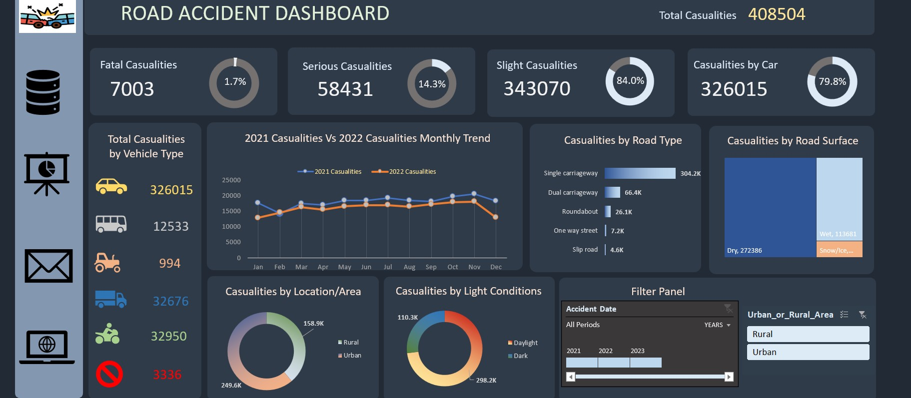

# Road Accident Analysis Dashboard (Excel Project)

## Project Overview
This project analyzes road accident data using Microsoft Excel to identify accident trends, severity distribution, and geographical patterns.

## Tools Used
- Microsoft Excel
- Pivot Tables
- Charts
- Data Cleaning
- Dashboard Design

## Dataset
- road_accident_raw_data.xlsx

## Dashboard

## Analysis Performed
- Total accidents analysis
- Accidents by severity
- Accidents by vehicle type
- Monthly trends
- Regional accident distribution

## Key Insights
- Majority accidents were slight severity
- Urban areas reported more accidents
- Certain months showed peak accident trends
